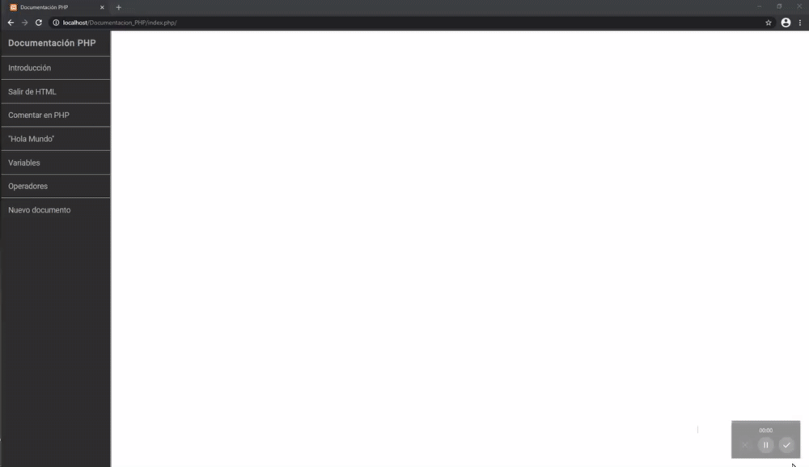
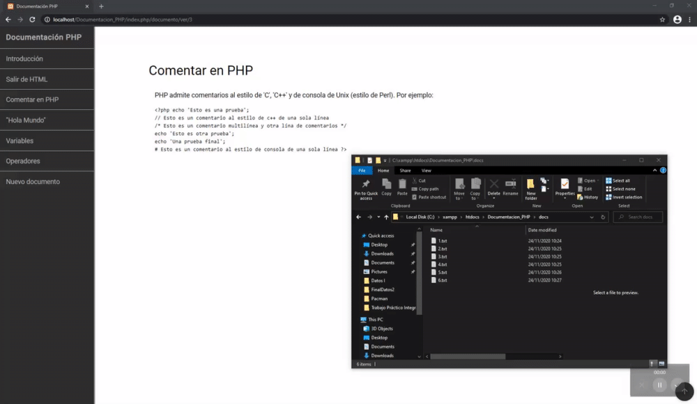

# documentation-website-codeigniter
Documentation website made with HTML/CSS + PHP in MySql server using Codeigniter. Loads the title of each document from the database and the body of the document from local documents that matches the number id of the title.

---

## Documentation showing how documents work 1

---

## Documentation showing how documents work 2

